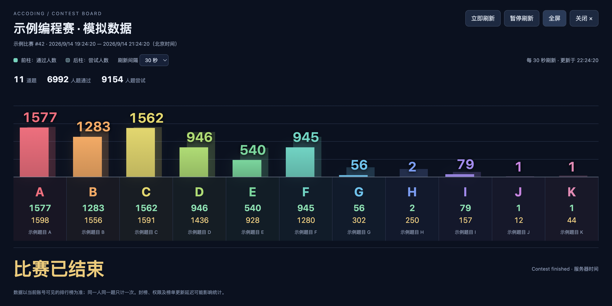

# Accoding Modern

北航 Accoding 管理站的本地界面美化与赛事统计看板。通过 Tampermonkey 运行，继续使用原站账号和业务操作。

## 安装

1. 浏览器安装并启用 Tampermonkey（篡改猴）。
2. [安装 / 更新脚本](https://raw.githubusercontent.com/y38501148-max/accoding-modern/main/accoding-modern.user.js)。
3. 在脚本安装窗口检查名称和生效网址后确认。
4. 打开或刷新 <https://accoding.buaa.edu.cn:4000/>。

目前仅匹配上述 HTTPS 管理站的 4000 端口。脚本不需要独立服务器。

## 赛事统计看板

- 赛事列表中，点击赛事旁边的 **统计看板**。
- 进入旧版赛事详情或 `contest-ng` 新版赛事页面后，点击右下角 **赛事统计看板**。
- 前方实色柱显示 **通过人数**，后方半透明柱显示 **尝试人数**；下方绿色和黄色数字分别对应两者。
- 按比赛内题序显示 A、B、C…，鼠标悬停可查看题名与统计。
- 未开始：显示开赛倒计时；进行中：显示剩余时间；已结束：显示结束状态。
- 支持全屏、手动刷新、15 / 30 / 60 秒定时刷新、暂停及 Esc 关闭。
- 刷新时新增的通过人数显示上浮提示；首次加载不播放，支持系统减少动态效果设置。
- 切到后台暂停轮询；返回前台时更新。关闭看板停止其请求与定时器。

统计来自当前账号可访问的 `/api/contests/:id/rank`，按原站榜单明细为每人每题计一次。反复提交不会增加尝试人数。顶部“人题通过／人题尝试”是各题人数的总和，**不是去重参赛人数或提交次数**。

看板读取赛事详情、排行榜及服务器时间三个接口。接口失败会显示错误；已有结果时保留上次成功数据和更新时间。没有权限、封榜和排行榜缓存会影响可见统计；看板不绕过原站限制，也不能提供比当前账号所见榜单更完整的数据。



## 题面 Markdown 兼容编辑（1.2.0）

进入题目的编辑页，直接粘贴普通 Markdown 或已有的 OJ 格式即可。

- `$a_i$` 与 `$a\_i$` 都按下标预览；保存统一为 `$a\_i$`，不重复转义。
- `\(…\)` / `\[…\]` 公式自动转为 `$…$` / `$$…$$`，避免旧 Markdown 引擎吞掉定界符。
- 顶层反引号或波浪线代码围栏转为四空格缩进；保留代码原有缩进、空行、尾随空格和下划线。现有缩进代码及行内代码不做公式转换。
- **复制通用 Markdown**：公式使用普通下标；现有四空格代码块仍是有效的通用 Markdown。
- **复制 OJ 格式**、**查看保存格式**：获得或核对后端将收到的题面源码。

预览调用原站 Markdown / MathJax。保存通过表单的 `formdata` 事件只转换 `description`，编辑框中的草稿不变；原站确认窗口、校验、文件上传和 SPJ 字段保留。不会自动点击保存。复制失败时会选中源码供手动复制。

## 界面美化

侧边导航、浅灰背景与白色内容卡片、蓝色操作按钮、题目正文与操作栏布局、编辑区及表单优化。列表新增当前页搜索与行高切换，窄窗口支持表格横向滚动。

**1.1.1 补齐赛时 Angular 页面**：`contest-ng` 的简介、题目、排名、提交和回复公告页面使用独立主题，包含比赛导航、倒计时卡片、题面、表格与筛选控件。支持初次异步加载和站内 hash 路由切换，无需每次刷新。排行榜筛选、题目切换及其他 Angular 绑定保留。

页面右上角 **恢复原版** 临时停用通用美化；点击 **启用新版界面** 可恢复。赛事看板是独立工具，仍可使用。要停用全部功能，在篡改猴管理面板中关闭本脚本并刷新。

接口与参考示例的核对见 [csrenderer 功能分析](docs/reference-analysis.md)。

## 本地开发

Node.js 18 或更高版本，无第三方依赖。

```bash
npm run check
```

修改 `src/theme.js`（管理页）、`src/contest-theme.js`（赛时页）、`src/contest-core.mjs` 、`src/contest-board.js`、`src/markdown-core.mjs` 或 `src/markdown-editor.js`，再执行 `npm run build` 生成根目录的 `accoding-modern.user.js`。不要直接修改构建产物。版本及安装地址位于 `scripts/build.mjs`。

如需通过本机临时服务安装：在仓库目录运行 `python3 -m http.server 18764 --bind 127.0.0.1`，用浏览器打开 `http://127.0.0.1:18764/accoding-modern.user.js` 并确认安装，随后关闭服务即可。安装副本与磁盘源码独立，改源码后需要重新构建、更新已安装脚本并刷新网站。

`tests/markdown-core.test.mjs` 验证转换与空白保留，`tests/browser-markdown.js` 在隔离的真实编辑页验证预览和序列化（替换原生提交入口，不发送保存请求）。`tests/contest-core.test.mjs` 验证人数、题序、数据格式、时间边界和零值等逻辑。`tests/browser-mock.js` 是可在一次性测试页面中注入的模拟数据，刷新页面即可清除；它不会被打包进用户脚本。模拟看板截图只使用该合成数据。

## 范围

脚本保留原站表单、控件与事件，不自动保存、上传、提交代码或触发重评。看板仅发送同源 GET 请求，数据只在当前页面内存中处理，不向 GitHub 或其他第三方上传比赛统计、Cookie 或账号信息。篡改猴可从本仓库下载脚本更新。

原站修改页面或接口后可能需要更新适配。已进行主要页面和看板的读取验证，没有为测试而执行云端写入。

本项目与北航或 Accoding 官方无隶属关系。

## License

MIT
